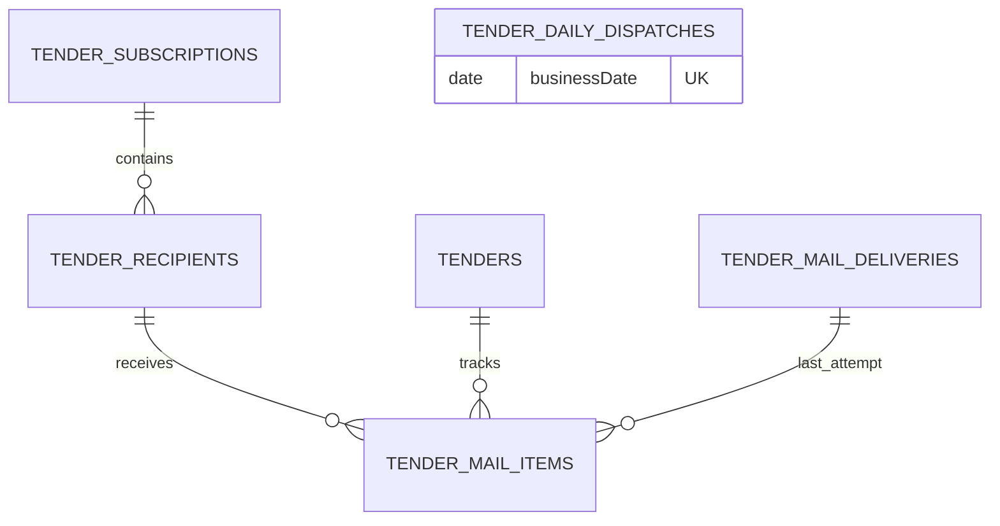

# Database Schema

## Tender notification tables

### `tenders`

| Column                                                   | Type                    | Notes                                                                       |
| -------------------------------------------------------- | ----------------------- | --------------------------------------------------------------------------- |
| `id`                                                     | UUID                    | Primary key                                                                 |
| `source`, `sourceNoticeId`, `revision`                   | varchar                 | `UQ_tender_source_notice_revision` unique key                               |
| `title`, `orderingOrganization`, `demandOrganization`    | varchar                 | Notice and organization information; demand organization is nullable        |
| `registeredAt`, `bidStartedAt`, `bidEndedAt`, `openedAt` | timestamptz             | Schedule dates; all except registration are nullable                        |
| `region`, `procurementType`, `contractMethod`            | varchar                 | Region is nullable; type is `GOODS`, `CONSTRUCTION`, `SERVICE`, or `OTHER`  |
| `estimatedAmount`                                        | bigint                  | Nullable; mapped to a string in TypeORM to preserve precision               |
| `sourceUrl`                                              | varchar                 | Official source link                                                        |
| `relevance`, `relevanceScore`, `relevanceReasons`        | varchar, integer, jsonb | Relevance is `DIRECT` or `POTENTIAL` and reasons retain classifier evidence |
| `rawData`                                                | jsonb                   | Original source response                                                    |
| `firstCollectedAt`, `lastUpdatedAt`                      | timestamptz             | Collection audit timestamps                                                 |

Indexes: `IDX_tender_registered_at`, `IDX_tender_source`, `IDX_tender_relevance`, `IDX_tender_region`, and `IDX_tender_procurement_type`.

### `tender_subscriptions`

| Column                   | Type        | Notes                                                                                                                 |
| ------------------------ | ----------- | --------------------------------------------------------------------------------------------------------------------- |
| `id`                     | UUID        | Primary key; the service maintains one shared row                                                                     |
| `singletonKey`           | varchar(16) | Always `shared`; unique through `UQ_tender_subscription_singleton_key` so concurrent bootstrap requests share one row |
| `enabled`                | boolean     | Defaults to `false`                                                                                                   |
| `deliveryTime`           | varchar(5)  | `HH:mm`, defaults to `09:00`; scheduling uses the fixed `Asia/Seoul` time zone                                        |
| `createdAt`, `updatedAt` | timestamptz | Audit timestamps                                                                                                      |

### `tender_recipients`

| Column           | Type        | Notes                                                          |
| ---------------- | ----------- | -------------------------------------------------------------- |
| `id`             | UUID        | Primary key                                                    |
| `subscriptionId` | UUID        | Foreign key to `tender_subscriptions.id`, `ON DELETE CASCADE`  |
| `email`          | varchar     | Normalized address, unique through `UQ_tender_recipient_email`; removal/re-addition retains this row and ID |
| `isActive`       | boolean     | Soft activation flag; defaults to `true`, GET/daily delivery/retry use active rows only |
| `createdAt`      | timestamptz | Creation timestamp                                             |

Index: `IDX_tender_recipient_subscription_active` on (`subscriptionId`, `isActive`).

### `tender_sync_runs`

| Column                                                          | Type          | Notes                                            |
| --------------------------------------------------------------- | ------------- | ------------------------------------------------ |
| `id`                                                            | UUID          | Primary key                                      |
| `source`                                                        | varchar       | `G2B`, `KAPT`, or `KEPCO`                        |
| `scheduledAt`, `startedAt`, `finishedAt`                        | timestamptz   | Start/end timestamps are nullable until recorded |
| `status`                                                        | varchar       | `RUNNING`, `SUCCEEDED`, or `FAILED`              |
| `fetchedCount`, `createdCount`, `updatedCount`, `excludedCount` | integer       | Per-run totals, default `0`                      |
| `errorCode`, `errorMessage`                                     | varchar, text | Safe failure diagnostics, both nullable          |
| `createdAt`                                                     | timestamptz   | Creation timestamp                               |

Indexes: `IDX_tender_sync_run_source` and `IDX_tender_sync_run_status`.

### `tender_mail_deliveries`

| Column                                                                            | Type                                                              | Notes                                                                     |
| --------------------------------------------------------------------------------- | ----------------------------------------------------------------- | ------------------------------------------------------------------------- |
| `id`                                                                              | UUID                                                              | Primary key                                                               |
| `recipientEmail`, `targetDate`                                                    | varchar, date                                                     | Recipient snapshot and digest date                                        |
| `attemptCount`                                                                    | integer                                                           | Starts at `0`; attempts are recorded as `1` and `2`                       |
| `status`                                                                          | varchar                                                           | `PENDING`, `SENT`, `FAILED`, `RETRY_SCHEDULED`, `SKIPPED`, `CANCELLED`, or terminal `DELIVERY_UNCERTAIN` |
| `nextRetryAt`, `claimedAt`, `smtpMessageId`, `sentAt`, `failedAt`, `uncertainAt`, `errorMessage` | timestamptz, timestamptz, varchar, timestamptz, timestamptz, timestamptz, text | Nullable retry, durable lease, known result, and ambiguous-result audit fields |
| `createdAt`, `updatedAt`                                                          | timestamptz                                                       | Audit timestamps                                                          |

Indexes: `IDX_tender_mail_delivery_status_next_retry_at`, `IDX_tender_mail_delivery_status_claimed_at`, and `IDX_tender_mail_delivery_recipient_target_date`.

### `tender_mail_items`

| Column                   | Type        | Notes                                                                    |
| ------------------------ | ----------- | ------------------------------------------------------------------------ |
| `id`                     | UUID        | Primary key                                                              |
| `recipientId`            | UUID        | Foreign key to `tender_recipients.id`, `ON DELETE CASCADE`               |
| `tenderId`               | UUID        | Foreign key to `tenders.id`, `ON DELETE CASCADE`                         |
| `status`                 | varchar     | `PENDING`, `SENT`, or terminal `DELIVERY_UNCERTAIN`                      |
| `lastDeliveryId`         | UUID        | Nullable foreign key to `tender_mail_deliveries.id`, `ON DELETE CASCADE` |
| `sentAt`                 | timestamptz | Nullable successful-send timestamp                                       |
| `uncertainAt`            | timestamptz | Nullable time when a stale in-flight SMTP outcome became terminal         |
| `createdAt`, `updatedAt` | timestamptz | Audit timestamps                                                         |

Unique constraint: `UQ_tender_mail_item_recipient_tender` on (`recipientId`, `tenderId`).

### `tender_daily_dispatches`

| Column                   | Type        | Notes                                                                 |
| ------------------------ | ----------- | --------------------------------------------------------------------- |
| `id`                     | UUID        | Primary key                                                           |
| `businessDate`           | date        | KST execution identity, unique through `UQ_tender_daily_dispatch_business_date` |
| `deliveryTime`           | varchar(5)  | Shared `HH:mm` value observed when the date was claimed               |
| `status`                 | varchar     | `CLAIMED` or `COMPLETED`                                              |
| `claimedAt`, `completedAt` | timestamptz | Durable claim and nullable completion timestamps                    |
| `createdAt`, `updatedAt` | timestamptz | Audit timestamps                                                      |

Index: `IDX_tender_daily_dispatch_status`. The unique KST business date is the final replica/time-change idempotency boundary in addition to advisory lock `824002`.

## Update rule

Whenever a migration changes this schema, update this root `database-schema.md` in the same change with affected tables, relationships, foreign-key deletion behavior, unique constraints, and indexes.

## Tender migration sequence

- `1706200000000-InitialSchema` enables `uuid-ossp` before the baseline UUID tables. `1787819500000-CreateTenderTables` repeats the idempotent extension guard and creates the six tender tables, baseline foreign keys, unique constraints, and query indexes.
- `1787819600000-AddTenderSubscriptionSingletonKey` adds the required shared subscription key and `UQ_tender_subscription_singleton_key`.
- `1787819700000-AddTenderMailDeliveryClaimedAt` adds the durable delivery lease timestamp and `IDX_tender_mail_delivery_status_claimed_at`.
- `1787819800000-HardenTenderMailDelivery` adds recipient soft activation, ambiguous SMTP audit timestamps, and the KST business-date daily dispatch table with its unique constraint and indexes.

The TypeORM source and compiled runtime both discover `tenders/entities/*.entity` and every migration under `migrations/`. Production deployments must execute the compiled migration command before the application starts; schema synchronization is not a replacement for this sequence.
