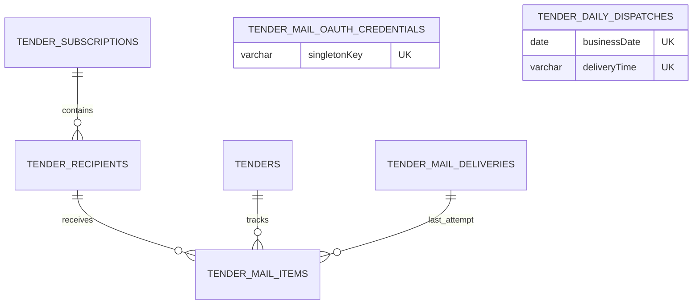

# Database Schema

## `admins`

| Column | Type | Notes |
| --- | --- | --- |
| `id` | serial | Primary key |
| `username` | varchar | Unique administrator identity |
| `password` | varchar | bcrypt hash only; no plaintext/default credential |

Fresh databases contain no administrator row. Production startup refuses an empty admin table; the compiled one-off provisioning CLI creates the first row under a serializable transaction plus PostgreSQL transaction advisory lock. `1787819900000-RemoveInsecureDefaultAdmin` removes only the exact `admin` row whose stored bcrypt hash verifies the historical `admin123` value, with id, username, and original hash in the delete predicate.

## `certificates`

| Column | Type | Notes |
| --- | --- | --- |
| `id` | uuid | Primary key; defaults to `uuid_generate_v4()` |
| `name` | varchar | Certificate name |
| `issuingOrganization` | varchar | Issuing organization |
| `category` | varchar | Nullable category |
| `markImage` | varchar | Nullable certification-mark image URL |
| `certificatePdf` | varchar | Nullable certificate PDF URL; canonical replacement for the retired `certificateImage` column |
| `createdAt`, `updatedAt` | timestamp | Creation and update timestamps |

The certificate migrations reconcile both fresh databases and databases that were historically created through TypeORM synchronization. If only `certificateImage` exists, it is renamed without rewriting data. If both PDF columns exist, a non-null `certificatePdf` value wins, otherwise the legacy value is copied before `certificateImage` is dropped. The final schema never retains the legacy column. Both historical certificate migrations are intentionally forward-only because either may baseline a pre-existing production table that is not owned by the migration ledger; rollback never renames the canonical column or drops the table.

## Tender notification tables

### `tenders`

| Column                                                   | Type                    | Notes                                                                       |
| -------------------------------------------------------- | ----------------------- | --------------------------------------------------------------------------- |
| `id`                                                     | UUID                    | Primary key                                                                 |
| `source`, `sourceNoticeId`, `revision`                   | varchar                 | `UQ_tender_source_notice_revision` unique key                               |
| `title`, `orderingOrganization`, `demandOrganization`    | varchar                 | Notice and organization information; demand organization is nullable        |
| `registeredAt`, `bidStartedAt`, `bidEndedAt`, `openedAt` | timestamptz             | Schedule dates; all except registration are nullable                        |
| `region`, `procurementType`, `contractMethod`            | varchar                 | Region is nullable; type is `GOODS`, `CONSTRUCTION`, `SERVICE`, or `OTHER`  |
| `estimatedAmount`                                        | bigint                  | Nullable; mapped to a string in TypeORM to preserve precision               |
| `sourceUrl`                                              | varchar                 | Official source link                                                        |
| `relevance`, `relevanceScore`, `relevanceReasons`        | varchar, integer, jsonb | Relevance is `DIRECT` or `POTENTIAL` and reasons retain classifier evidence |
| `rawData`                                                | jsonb                   | Original source response                                                    |
| `firstCollectedAt`, `lastUpdatedAt`                      | timestamptz             | Collection audit timestamps                                                 |

Indexes: `IDX_tender_registered_at`, `IDX_tender_source`, `IDX_tender_relevance`, `IDX_tender_region`, and `IDX_tender_procurement_type`.

### `tender_subscriptions`

| Column                   | Type        | Notes                                                                                                                 |
| ------------------------ | ----------- | --------------------------------------------------------------------------------------------------------------------- |
| `id`                     | UUID        | Primary key; the service maintains one shared row                                                                     |
| `singletonKey`           | varchar(16) | Always `shared`; unique through `UQ_tender_subscription_singleton_key` so concurrent bootstrap requests share one row |
| `enabled`                | boolean     | Defaults to `false`                                                                                                   |
| `deliveryTime`           | varchar(5)  | `HH:mm`, defaults to `09:00`; scheduling uses the fixed `Asia/Seoul` time zone                                        |
| `createdAt`, `updatedAt` | timestamptz | Audit timestamps                                                                                                      |

### `tender_recipients`

| Column           | Type        | Notes                                                          |
| ---------------- | ----------- | -------------------------------------------------------------- |
| `id`             | UUID        | Primary key                                                    |
| `subscriptionId` | UUID        | Foreign key to `tender_subscriptions.id`, `ON DELETE CASCADE`  |
| `email`          | varchar     | Normalized address, unique through `UQ_tender_recipient_email`; removal/re-addition retains this row and ID |
| `isActive`       | boolean     | Soft activation flag; defaults to `true`, GET/daily delivery/retry use active rows only |
| `createdAt`      | timestamptz | Creation timestamp                                             |

Index: `IDX_tender_recipient_subscription_active` on (`subscriptionId`, `isActive`).

### `tender_sync_runs`

| Column                                                          | Type          | Notes                                            |
| --------------------------------------------------------------- | ------------- | ------------------------------------------------ |
| `id`                                                            | UUID          | Primary key                                      |
| `source`                                                        | varchar       | `G2B`, `KAPT`, or `KEPCO`                        |
| `scheduledAt`, `startedAt`, `finishedAt`                        | timestamptz   | Start/end timestamps are nullable until recorded |
| `status`                                                        | varchar       | `RUNNING`, `SUCCEEDED`, or `FAILED`              |
| `fetchedCount`, `createdCount`, `updatedCount`, `excludedCount` | integer       | Per-run totals, default `0`                      |
| `errorCode`, `errorMessage`                                     | varchar, text | Safe failure diagnostics, both nullable          |
| `createdAt`                                                     | timestamptz   | Creation timestamp                               |

Indexes: `IDX_tender_sync_run_source` and `IDX_tender_sync_run_status`.

### `tender_mail_deliveries`

| Column                                                                            | Type                                                              | Notes                                                                     |
| --------------------------------------------------------------------------------- | ----------------------------------------------------------------- | ------------------------------------------------------------------------- |
| `id`                                                                              | UUID                                                              | Primary key                                                               |
| `dailyDispatchId`                                                                 | UUID                                                              | Nullable FK to `tender_daily_dispatches.id`, `ON DELETE SET NULL`; old rows remain nullable |
| `recipientId`                                                                     | UUID                                                              | Nullable FK to `tender_recipients.id`, `ON DELETE SET NULL`; old rows remain nullable |
| `recipientEmail`, `targetDate`                                                    | varchar, date                                                     | Recipient snapshot and digest date                                        |
| `attemptCount`                                                                    | integer                                                           | Starts at `0`; attempts are recorded as `1` and `2`                       |
| `status`                                                                          | varchar                                                           | `PENDING`, `SENT`, `FAILED`, `RETRY_SCHEDULED`, `SKIPPED`, `CANCELLED`, or terminal `DELIVERY_UNCERTAIN` |
| `nextRetryAt`, `claimedAt`, `providerMessageId`, `sentAt`, `failedAt`, `uncertainAt`, `errorMessage` | timestamptz, timestamptz, varchar, timestamptz, timestamptz, timestamptz, text | Nullable retry, durable lease, provider-neutral acknowledgement, known result, and ambiguous-result audit fields |
| `createdAt`, `updatedAt`                                                          | timestamptz                                                       | Audit timestamps                                                          |

Indexes: `IDX_tender_mail_delivery_status_next_retry_at`, `IDX_tender_mail_delivery_status_claimed_at`, and `IDX_tender_mail_delivery_recipient_target_date`.

Unique constraint: `UQ_tender_mail_delivery_dispatch_recipient` on (`dailyDispatchId`, `recipientId`). It is the per-dispatch recipient outcome identity: any durable status, including `SKIPPED`, prevents a stale daily claim from creating another delivery for that recipient. Null legacy rows do not conflict.

### `tender_mail_items`

| Column                   | Type        | Notes                                                                    |
| ------------------------ | ----------- | ------------------------------------------------------------------------ |
| `id`                     | UUID        | Primary key                                                              |
| `recipientId`            | UUID        | Foreign key to `tender_recipients.id`, `ON DELETE CASCADE`               |
| `tenderId`               | UUID        | Foreign key to `tenders.id`, `ON DELETE CASCADE`                         |
| `status`                 | varchar     | `PENDING`, `SENT`, or terminal `DELIVERY_UNCERTAIN`                      |
| `lastDeliveryId`         | UUID        | Nullable foreign key to `tender_mail_deliveries.id`, `ON DELETE CASCADE` |
| `sentAt`                 | timestamptz | Nullable successful-send timestamp                                       |
| `uncertainAt`            | timestamptz | Nullable time when a stale in-flight mail-provider outcome became terminal |
| `createdAt`, `updatedAt` | timestamptz | Audit timestamps                                                         |

Unique constraint: `UQ_tender_mail_item_recipient_tender` on (`recipientId`, `tenderId`).

### `tender_mail_oauth_credentials`

| Column | Type | Notes |
| --- | --- | --- |
| `id` | UUID | Primary key |
| `singletonKey` | varchar(32) | Always `naver-works`; unique through `UQ_tender_mail_oauth_credential_singleton_key` |
| `provider` | varchar(32) | Mail provider identifier; defaults to `NAVER_WORKS` |
| `accessTokenEncrypted`, `refreshTokenEncrypted` | text | Nullable AES-256-GCM encrypted OAuth tokens; plaintext tokens are never stored |
| `accessTokenExpiresAt` | timestamptz | Nullable access-token expiry with refresh skew already applied |
| `scope` | varchar | Nullable granted OAuth scope |
| `oauthStateHash` | varchar(64) | Nullable SHA-256 hash of the single-use authorization state; the raw state is never stored |
| `oauthStateExpiresAt` | timestamptz | Nullable authorization-state expiry |
| `connectedAt` | timestamptz | Nullable time when an authorization code was successfully exchanged |
| `createdAt`, `updatedAt` | timestamptz | Audit timestamps |

Unique constraint: `UQ_tender_mail_oauth_credential_singleton_key` on (`singletonKey`). This table has no recipient or subscription foreign key because one authorized NAVER WORKS sender is shared by the common subscription. `NAVER_WORKS_TOKEN_ENCRYPTION_KEY` remains in the deployment secret store and is never persisted in PostgreSQL.

### `tender_daily_dispatches`

| Column                   | Type        | Notes                                                                 |
| ------------------------ | ----------- | --------------------------------------------------------------------- |
| `id`                     | UUID        | Primary key                                                           |
| `businessDate`           | date        | KST date portion of the execution identity                            |
| `deliveryTime`           | varchar(5)  | Shared `HH:mm` value; together with `businessDate`, unique through `UQ_tender_daily_dispatch_business_date_delivery_time` |
| `status`                 | varchar     | `CLAIMED` or `COMPLETED`                                              |
| `claimedAt`, `leaseExpiresAt`, `completedAt` | timestamptz | Durable claim, 15-minute reclaim boundary, and nullable completion timestamp |
| `lastError`               | text        | Nullable non-sensitive recipient-claim failure summary              |
| `createdAt`, `updatedAt` | timestamptz | Audit timestamps                                                      |

Index: `IDX_tender_daily_dispatch_status_lease` on (`status`, `leaseExpiresAt`). The unique KST (`businessDate`, `deliveryTime`) slot is the final replica idempotency boundary in addition to advisory lock `824002`. Changing the shared time on the same date creates another slot without deleting prior audit rows. A fresh `CLAIMED` lease is skipped; a stale claim can be atomically reclaimed and processes only recipients without an existing durable outcome for that slot.

## Update rule

Whenever a migration changes this schema, update this root `database-schema.md` in the same change with affected tables, relationships, foreign-key deletion behavior, unique constraints, and indexes.

## Migration sequence

Before the tender migrations, `1740100000000-RenameCertificateImageToPdf` and `1771481900000-CreateCertificatesTable` converge legacy and fresh certificate databases on the current `certificates` entity schema. Both migrations are safe when the table or canonical columns already exist.

- `1706200000000-InitialSchema` enables `uuid-ossp` before the baseline UUID tables. `1787819500000-CreateTenderTables` repeats the idempotent extension guard and creates the six tender tables, baseline foreign keys, unique constraints, and query indexes.
- `1787819600000-AddTenderSubscriptionSingletonKey` adds the required shared subscription key and `UQ_tender_subscription_singleton_key`.
- `1787819700000-AddTenderMailDeliveryClaimedAt` adds the durable delivery lease timestamp and `IDX_tender_mail_delivery_status_claimed_at`.
- `1787819800000-HardenTenderMailDelivery` adds recipient soft activation, ambiguous mail-delivery audit timestamps, and the KST business-date daily dispatch table with its unique constraint and indexes.
- `1787819900000-RemoveInsecureDefaultAdmin` removes only the exact historical `admin/admin123` bcrypt identity and never recreates it on rollback; fresh baseline migration no longer seeds credentials.
- `1787820000000-AddDailyDispatchLease` adds `leaseExpiresAt`, safe `lastError`, and replaces the status-only daily index with `IDX_tender_daily_dispatch_status_lease`.
- `1787820100000-LinkDailyDispatchDeliveries` adds nullable dispatch/recipient foreign keys to delivery history and `UQ_tender_mail_delivery_dispatch_recipient`, so a reclaimed daily dispatch resumes only recipients with no durable outcome.
- `1787820200000-UseNaverWorksMailApi` is the expand phase for a rolling deployment. It creates the singleton encrypted OAuth credential table, adds `providerMessageId`, copies existing `smtpMessageId` audit values, and temporarily keeps both columns synchronized with a trigger while old and new containers can coexist. Its rollback copies canonical values back before removing the new column. A separately deployed contract migration removes the synchronization trigger and `smtpMessageId` only after the new application version is healthy; the final schema retains only `providerMessageId`.
- `1787820300000-DropLegacyTenderSmtpMessageId` is that contract phase. It performs a final null-only backfill, removes the compatibility trigger/function, and drops `smtpMessageId`. Its rollback recreates the legacy column from `providerMessageId` and restores bidirectional synchronization.
- `1787820400000-AllowMultipleDailyDispatchTimes` replaces the date-only dispatch unique constraint with `UQ_tender_daily_dispatch_business_date_delivery_time`. It preserves every existing dispatch and allows a changed shared time to create another same-day slot. Rollback refuses to collapse multiple same-day audit rows instead of deleting history.

The TypeORM source and compiled runtime both discover `tenders/entities/*.entity` and every migration under `migrations/`. Production deployments must execute the compiled migration command before the application starts; schema synchronization is not a replacement for this sequence.
