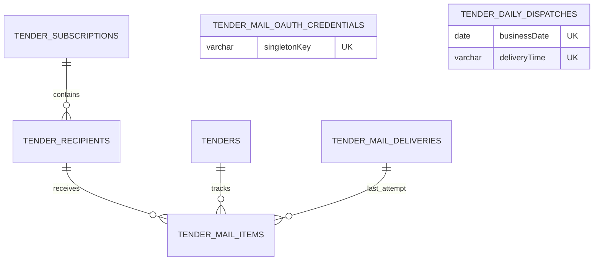

# Database Schema

## `admins`

| Column | Type | Notes |
| --- | --- | --- |
| `id` | serial | Primary key |
| `username` | varchar | Unique administrator identity |
| `password` | varchar | bcrypt hash only; no plaintext/default credential |

Fresh databases contain no administrator row. Production startup refuses an empty admin table; the compiled one-off provisioning CLI creates the first row under a serializable transaction plus PostgreSQL transaction advisory lock. `1787819900000-RemoveInsecureDefaultAdmin` removes only the exact `admin` row whose stored bcrypt hash verifies the historical `admin123` value, with id, username, and original hash in the delete predicate.

## `certificates`

| Column | Type | Notes |
| --- | --- | --- |
| `id` | uuid | Primary key; defaults to `uuid_generate_v4()` |
| `name` | varchar | Certificate name |
| `issuingOrganization` | varchar | Issuing organization |
| `category` | varchar | Nullable category |
| `markImage` | varchar | Nullable certification-mark image URL |
| `certificatePdf` | varchar | Nullable certificate PDF URL; canonical replacement for the retired `certificateImage` column |
| `createdAt`, `updatedAt` | timestamp | Creation and update timestamps |

The certificate migrations reconcile both fresh databases and databases that were historically created through TypeORM synchronization. If only `certificateImage` exists, it is renamed without rewriting data. If both PDF columns exist, a non-null `certificatePdf` value wins, otherwise the legacy value is copied before `certificateImage` is dropped. The final schema never retains the legacy column. Both historical certificate migrations are intentionally forward-only because either may baseline a pre-existing production table that is not owned by the migration ledger; rollback never renames the canonical column or drops the table.

## Tender notification tables

### `tenders`

| Column                                                   | Type                    | Notes                                                                       |
| -------------------------------------------------------- | ----------------------- | --------------------------------------------------------------------------- |
| `id`                                                     | UUID                    | Primary key                                                                 |
| `source`, `sourceNoticeId`, `revision`                   | varchar                 | `UQ_tender_source_notice_revision` unique key                               |
| `title`, `orderingOrganization`, `demandOrganization`    | varchar                 | Notice and organization information; demand organization is nullable        |
| `registeredAt`, `bidStartedAt`, `bidEndedAt`, `openedAt` | timestamptz             | Schedule dates; all except registration are nullable                        |
| `region`, `procurementType`, `contractMethod`            | varchar                 | Region is nullable; type is `GOODS`, `CONSTRUCTION`, `SERVICE`, or `OTHER`  |
| `estimatedAmount`                                        | bigint                  | Nullable; mapped to a string in TypeORM to preserve precision               |
| `sourceUrl`                                              | varchar                 | Official source link                                                        |
| `relevance`, `relevanceScore`, `relevanceReasons`        | varchar, integer, jsonb | Relevance is `DIRECT` or `POTENTIAL` and reasons retain classifier evidence |
| `opportunityType`, `opportunityReasons`                  | varchar, jsonb          | Legacy non-null classification columns retained for migration-history and production-data safety; the application no longer uses them to filter collection, calendar/list queries, or mail delivery |
| `rawData`                                                | jsonb                   | Original source response                                                    |
| `firstCollectedAt`, `lastUpdatedAt`                      | timestamptz             | Collection audit timestamps                                                 |

Indexes: `IDX_tender_registered_at`, `IDX_tender_source`, `IDX_tender_relevance`, `IDX_tender_region`, `IDX_tender_procurement_type`, and `IDX_tender_opportunity_type`.

`1788135000000-AddTenderOpportunityType` previously added and backfilled supply-opportunity classification. The migration remains immutable because it has already run in production, but the broad tender workflow no longer reads these columns or their index. No rollback migration is executed, so existing tender and mail history remains untouched.

### `tender_subscriptions`

| Column                   | Type        | Notes                                                                                                                 |
| ------------------------ | ----------- | --------------------------------------------------------------------------------------------------------------------- |
| `id`                     | UUID        | Primary key; the service maintains one shared row                                                                     |
| `singletonKey`           | varchar(16) | Always `shared`; unique through `UQ_tender_subscription_singleton_key` so concurrent bootstrap requests share one row |
| `enabled`                | boolean     | Defaults to `false`                                                                                                   |
| `deliveryTime`           | varchar(5)  | `HH:mm`, defaults to `09:00`; scheduling uses the fixed `Asia/Seoul` time zone                                        |
| `createdAt`, `updatedAt` | timestamptz | Audit timestamps                                                                                                      |

### `tender_recipients`

| Column           | Type        | Notes                                                          |
| ---------------- | ----------- | -------------------------------------------------------------- |
| `id`             | UUID        | Primary key                                                    |
| `subscriptionId` | UUID        | Foreign key to `tender_subscriptions.id`, `ON DELETE CASCADE`  |
| `email`          | varchar     | Normalized address, unique through `UQ_tender_recipient_email`; removal/re-addition retains this row and ID |
| `isActive`       | boolean     | Soft activation flag; defaults to `true`, GET/daily delivery/retry use active rows only |
| `createdAt`      | timestamptz | Creation timestamp                                             |

Index: `IDX_tender_recipient_subscription_active` on (`subscriptionId`, `isActive`).

### `tender_sync_runs`

| Column                                                          | Type          | Notes                                            |
| --------------------------------------------------------------- | ------------- | ------------------------------------------------ |
| `id`                                                            | UUID          | Primary key                                      |
| `source`                                                        | varchar       | `G2B`, `KAPT`, or `KEPCO`                        |
| `scheduledAt`, `startedAt`, `finishedAt`                        | timestamptz   | Start/end timestamps are nullable until recorded |
| `status`                                                        | varchar       | `RUNNING`, `SUCCEEDED`, `PARTIAL`, or `FAILED`   |
| `fetchedCount`, `createdCount`, `updatedCount`, `excludedCount` | integer       | Per-run totals, default `0`                      |
| `errorCode`, `errorMessage`                                     | varchar, text | Safe failure diagnostics, both nullable          |
| `createdAt`                                                     | timestamptz   | Creation timestamp                               |

Indexes: `IDX_tender_sync_run_source` and `IDX_tender_sync_run_status`.

### `tender_mail_deliveries`

| Column                                                                            | Type                                                              | Notes                                                                     |
| --------------------------------------------------------------------------------- | ----------------------------------------------------------------- | ------------------------------------------------------------------------- |
| `id`                                                                              | UUID                                                              | Primary key                                                               |
| `dailyDispatchId`                                                                 | UUID                                                              | Nullable FK to `tender_daily_dispatches.id`, `ON DELETE SET NULL`; old rows remain nullable |
| `recipientId`                                                                     | UUID                                                              | Nullable FK to `tender_recipients.id`, `ON DELETE SET NULL`; old rows remain nullable |
| `recipientEmail`, `targetDate`                                                    | varchar, date                                                     | Recipient snapshot and digest date                                        |
| `attemptCount`                                                                    | integer                                                           | Starts at `0`; attempts are recorded as `1` and `2`                       |
| `status`                                                                          | varchar                                                           | `PENDING`, `SENT`, `FAILED`, `RETRY_SCHEDULED`, `SKIPPED`, `CANCELLED`, or terminal `DELIVERY_UNCERTAIN` |
| `nextRetryAt`, `claimedAt`, `providerMessageId`, `sentAt`, `failedAt`, `uncertainAt`, `errorMessage` | timestamptz, timestamptz, varchar, timestamptz, timestamptz, timestamptz, text | Nullable retry, durable lease, provider-neutral acknowledgement, known result, and ambiguous-result audit fields |
| `createdAt`, `updatedAt`                                                          | timestamptz                                                       | Audit timestamps                                                          |

Indexes: `IDX_tender_mail_delivery_status_next_retry_at`, `IDX_tender_mail_delivery_status_claimed_at`, and `IDX_tender_mail_delivery_recipient_target_date`.

Unique constraint: `UQ_tender_mail_delivery_dispatch_recipient` on (`dailyDispatchId`, `recipientId`). It is the per-dispatch recipient outcome identity: any durable status, including `SKIPPED`, prevents a stale daily claim from creating another delivery for that recipient. Null legacy rows do not conflict.

### `tender_mail_items`

| Column                   | Type        | Notes                                                                    |
| ------------------------ | ----------- | ------------------------------------------------------------------------ |
| `id`                     | UUID        | Primary key                                                              |
| `recipientId`            | UUID        | Foreign key to `tender_recipients.id`, `ON DELETE CASCADE`               |
| `tenderId`               | UUID        | Foreign key to `tenders.id`, `ON DELETE CASCADE`                         |
| `status`                 | varchar     | `PENDING`, `SENT`, or terminal `DELIVERY_UNCERTAIN`                      |
| `lastDeliveryId`         | UUID        | Nullable foreign key to `tender_mail_deliveries.id`, `ON DELETE CASCADE` |
| `sentAt`                 | timestamptz | Nullable successful-send timestamp                                       |
| `uncertainAt`            | timestamptz | Nullable time when a stale in-flight mail-provider outcome became terminal |
| `createdAt`, `updatedAt` | timestamptz | Audit timestamps                                                         |

Unique constraint: `UQ_tender_mail_item_recipient_tender` on (`recipientId`, `tenderId`).

### `tender_mail_oauth_credentials`

| Column | Type | Notes |
| --- | --- | --- |
| `id` | UUID | Primary key |
| `singletonKey` | varchar(32) | Always `naver-works`; unique through `UQ_tender_mail_oauth_credential_singleton_key` |
| `provider` | varchar(32) | Mail provider identifier; defaults to `NAVER_WORKS` |
| `accessTokenEncrypted`, `refreshTokenEncrypted` | text | Nullable AES-256-GCM encrypted OAuth tokens; plaintext tokens are never stored |
| `accessTokenExpiresAt` | timestamptz | Nullable access-token expiry with refresh skew already applied |
| `scope` | varchar | Nullable granted OAuth scope |
| `oauthStateHash` | varchar(64) | Nullable SHA-256 hash of the single-use authorization state; the raw state is never stored |
| `oauthStateExpiresAt` | timestamptz | Nullable authorization-state expiry |
| `connectedAt` | timestamptz | Nullable time when an authorization code was successfully exchanged |
| `createdAt`, `updatedAt` | timestamptz | Audit timestamps |

Unique constraint: `UQ_tender_mail_oauth_credential_singleton_key` on (`singletonKey`). This table has no recipient or subscription foreign key because one authorized NAVER WORKS sender is shared by the common subscription. `NAVER_WORKS_TOKEN_ENCRYPTION_KEY` remains in the deployment secret store and is never persisted in PostgreSQL.

### `tender_daily_dispatches`

| Column                   | Type        | Notes                                                                 |
| ------------------------ | ----------- | --------------------------------------------------------------------- |
| `id`                     | UUID        | Primary key                                                           |
| `businessDate`           | date        | KST date portion of the execution identity                            |
| `deliveryTime`           | varchar(5)  | Shared `HH:mm` value; together with `businessDate`, unique through `UQ_tender_daily_dispatch_business_date_delivery_time` |
| `status`                 | varchar     | `CLAIMED` or `COMPLETED`                                              |
| `claimedAt`, `leaseExpiresAt`, `completedAt` | timestamptz | Durable claim, 15-minute reclaim boundary, and nullable completion timestamp |
| `lastError`               | text        | Nullable non-sensitive recipient-claim failure summary              |
| `createdAt`, `updatedAt` | timestamptz | Audit timestamps                                                      |

Index: `IDX_tender_daily_dispatch_status_lease` on (`status`, `leaseExpiresAt`). The unique KST (`businessDate`, `deliveryTime`) slot is the final replica idempotency boundary in addition to advisory lock `824002`. Changing the shared time on the same date creates another slot without deleting prior audit rows. A fresh `CLAIMED` lease is skipped; a stale claim can be atomically reclaimed and processes only recipients without an existing durable outcome for that slot.

### Tender suitability analysis tables

`1788699000000-CreateTenderAnalysisTables` adds the persistent inputs and compact outputs for tender suitability analysis. The source TypeORM discovery glob already includes `src/tenders/entities/*.entity.ts`; the Nest application also registers these entities explicitly for its runtime connection. The tables do not store source-document binary, provider award payloads, bidder names, bidder business numbers, or complete rankings.

### `tender_company_profiles`

| Column | Type | Notes |
| --- | --- | --- |
| `id` | UUID | Primary key |
| `singletonKey` | varchar(32) | Always one profile; `UQ_tender_company_profile_singleton_key` enforces this |
| `companyName`, `businessNumber` | varchar | Company identity; the service normalizes the 10 digit business number |
| `headquartersSido`, `headquartersSigungu`, `g2bRegistered` | varchar, varchar, boolean | Participant location and G2B registration state |
| `supplyProducts`, `licenses`, `companyTypes`, `directProduction`, `certifications`, `performanceRecords` | jsonb | Normalized, validated profile collections only |
| `version`, `createdAt`, `updatedAt` | integer, timestamptz | Replacement version and audit timestamps |

### `tender_documents`

| Column | Type | Notes |
| --- | --- | --- |
| `id`, `tenderId` | UUID | Primary key and FK to `tenders.id`, `ON DELETE CASCADE` |
| `sourceDocumentIdentity` | varchar | Unique with `tenderId` through `UQ_tender_document_tender_identity` |
| `displayName`, `sourceUrl`, `mimeType`, `format`, `contentHash` | varchar | Safe document metadata and a normalized content hash |
| `status`, `errorCode`, `extractedAt` | varchar, varchar, timestamptz | Extraction state, safe failure code, and completion time |
| `textBlocks`, `tableBlocks`, `extractionMetadata` | jsonb | Normalized extracted output; original bytes are never persisted |
| `createdAt`, `updatedAt` | timestamptz | Audit timestamps |

Index: `IDX_tender_document_tender_status` on (`tenderId`, `status`).

### `tender_analyses` and `tender_analysis_reviews`

`tender_analyses.tenderId` is a cascading FK to `tenders.id` and `UQ_tender_analysis_tender` retains one current analysis per tender. It stores the tender, document, company-profile, and product-catalog fingerprints; analyzer version; status/suitability; nullable numeric specification score; comparable/satisfied/unsatisfied/unknown counts; normalized requirements; certification, participation and compact price analyses; evidence; worker lease; safe error code; and audit timestamps. `IDX_tender_analysis_status_lease` on (`status`, `leaseExpiresAt`) supports recovery of interrupted work.

`reviewSemanticDigest` is a nullable `varchar(64)` added by `1788699200000-AddTenderReviewSemanticDigest`. It stores SHA-256 over all canonical normalized requirement, evaluation, formula and diagnostic semantics before display caps. Each textual semantic field is hashed before canonical aggregation; complete text is never stored in this column. Existing rows remain null until the `rules-2` version sweep reanalyzes source inputs; already clipped evidence cannot reconstruct omitted facts. The additive migration does not modify review history. Detail JSON is projected to known fields with 320-character text / 128-character identifiers / 64-character decimals / 80-element arrays and a 16 KiB limit per section; evidence has independent diagnostic category quotas and an 80-item / 48 KiB total cap. Projection applies before persistence and again to legacy responses. Diagnostic evidence also retains a 64-character `semanticId` computed from canonical condition/source-anchor hashes before quotas; it preserves deterministic display order after related source citations are omitted. Long identities become stable hash tokens, oversized decimals are null, and safe truncation diagnostics explain omitted display data.

`tender_analysis_reviews` stores immutable analysis fingerprint context, review status, 2,000-character internal note, nullable integer `reviewerAdminId` matching the existing `admins.id`, and timestamps. Its `tenderId` FK cascades on tender deletion. `analysisId` is nullable and uses `ON DELETE SET NULL`, preserving a historic review when a current analysis row is replaced.

The corrective migration `1788699100000-FixTenderReviewAdminIdentity` changes the unreleased review UUID identity column to integer. Both up and down acquire an exclusive table lock and refuse non-null identities before conversion; existing reviews must never be silently erased or assigned an invented admin. No admin FK is added, so a historic numeric reviewer reference survives later admin removal.

Analysis queue changes clear the claim token and lease. Profile replacement/version increment invalidates current analyses in the same transaction. Product fingerprints use the sorted global ID/updatedAt set. Final document replacement and analysis writes occur only after token/lease/current-input checks in one transaction. Review history remains immutable when a current analysis changes.

### `tender_award_results` and `tender_award_sync_runs`

`tender_award_results` stores only the source, notice/revision, product classification/group, method, region, opening time, precision-safe numeric basis/expected/winning amounts and rates, final-award/failed-bid flags, and collection timestamps. `UQ_tender_award_result_identity` covers (`source`, `sourceNoticeId`, `revision`, `productClassification`, `openedAt`). The price-statistic indexes are `IDX_tender_award_result_opened_at` on `openedAt` and `IDX_tender_award_result_classification_method_region` on (`productClassification`, `awardMethod`, `region`).

`tender_award_sync_runs` stores source and monthly/incremental period identity, resume cursor, status/counts, worker lease, safe error code, completion time, and audit timestamps. `UQ_tender_award_sync_run_source_period` prevents duplicate source-period processing; `IDX_tender_award_sync_run_status_lease` on (`status`, `leaseExpiresAt`) supports stale-job recovery.

## Update rule

Whenever a migration changes this schema, update this root `database-schema.md` in the same change with affected tables, relationships, foreign-key deletion behavior, unique constraints, and indexes.

## Migration sequence

Before the tender migrations, `1740100000000-RenameCertificateImageToPdf` and `1771481900000-CreateCertificatesTable` converge legacy and fresh certificate databases on the current `certificates` entity schema. Both migrations are safe when the table or canonical columns already exist.

- `1706200000000-InitialSchema` enables `uuid-ossp` before the baseline UUID tables. `1787819500000-CreateTenderTables` repeats the idempotent extension guard and creates the six tender tables, baseline foreign keys, unique constraints, and query indexes.
- `1787819600000-AddTenderSubscriptionSingletonKey` adds the required shared subscription key and `UQ_tender_subscription_singleton_key`.
- `1787819700000-AddTenderMailDeliveryClaimedAt` adds the durable delivery lease timestamp and `IDX_tender_mail_delivery_status_claimed_at`.
- `1787819800000-HardenTenderMailDelivery` adds recipient soft activation, ambiguous mail-delivery audit timestamps, and the KST business-date daily dispatch table with its unique constraint and indexes.
- `1787819900000-RemoveInsecureDefaultAdmin` removes only the exact historical `admin/admin123` bcrypt identity and never recreates it on rollback; fresh baseline migration no longer seeds credentials.
- `1787820000000-AddDailyDispatchLease` adds `leaseExpiresAt`, safe `lastError`, and replaces the status-only daily index with `IDX_tender_daily_dispatch_status_lease`.
- `1787820100000-LinkDailyDispatchDeliveries` adds nullable dispatch/recipient foreign keys to delivery history and `UQ_tender_mail_delivery_dispatch_recipient`, so a reclaimed daily dispatch resumes only recipients with no durable outcome.
- `1787820200000-UseNaverWorksMailApi` is the expand phase for a rolling deployment. It creates the singleton encrypted OAuth credential table, adds `providerMessageId`, copies existing `smtpMessageId` audit values, and temporarily keeps both columns synchronized with a trigger while old and new containers can coexist. Its rollback copies canonical values back before removing the new column. A separately deployed contract migration removes the synchronization trigger and `smtpMessageId` only after the new application version is healthy; the final schema retains only `providerMessageId`.
- `1787820300000-DropLegacyTenderSmtpMessageId` is that contract phase. It performs a final null-only backfill, removes the compatibility trigger/function, and drops `smtpMessageId`. Its rollback recreates the legacy column from `providerMessageId` and restores bidirectional synchronization.
- `1787820400000-AllowMultipleDailyDispatchTimes` replaces the date-only dispatch unique constraint with `UQ_tender_daily_dispatch_business_date_delivery_time`. It preserves every existing dispatch and allows a changed shared time to create another same-day slot. Rollback refuses to collapse multiple same-day audit rows instead of deleting history.
- `1788135000000-AddTenderOpportunityType` is retained as an already-applied production migration. Its columns and index are legacy compatibility data and no longer control collection, display, or mail delivery; no destructive rollback is run.
- `1788135100000-FixKaptSourceUrls` is a data-only, row-preserving correction. It changes only stale K-apt `sourceUrl` values from the known 404 `/web/bid/bidDetail.do` prefix to the canonical `/bid/bidDetail.do` prefix; it does not add or remove columns, delete rows, or alter tender and mail history. Rollback is intentionally a no-op so a valid URL is never restored to the broken route.
- `1788699000000-CreateTenderAnalysisTables` adds company qualification, ephemeral-document extraction metadata, one current tender analysis, historic reviews, normalized award statistics, and restartable award-sync state. Its rollback drops only these six new tables in reverse foreign-key order.
- `1788699100000-FixTenderReviewAdminIdentity` converts the unreleased nullable `tender_analysis_reviews.reviewerAdminId` from UUID to integer so it matches `admins.id`. The migration takes an exclusive table lock and refuses to convert when any non-null identity exists; it does not add an admin foreign key or rewrite review ownership.
- `1788699200000-AddTenderReviewSemanticDigest` adds nullable `tender_analyses.reviewSemanticDigest varchar(64)`. Existing rows stay null until source reanalysis computes the canonical pre-display-cap digest, and the migration does not infer omitted semantics from previously clipped JSON.

The TypeORM source and compiled runtime both discover `tenders/entities/*.entity` and every migration under `migrations/`. Production deployments must execute the compiled migration command before the application starts; schema synchronization is not a replacement for this sequence.

## 온라인 견적 (2026-09-06)

마이그레이션: `dfkorea-backend/src/migrations/1788652800000-CreateQuoteTables.ts` 및 추가 전용 `1788652900000-AddQuoteAttachmentPayloads.ts`. 이전 migration은 변경하지 않는다. 사진 저장 정책은 메일 첨부용 임시 DB 방식으로 전환했다.
엔티티 발견: `src/quotes/entities/*.entity.ts`(컴파일 후 동일 `.js`), 애플리케이션에 `QUOTE_ENTITIES` 등록.
운영 DB는 migration-only이며 synchronize를 사용하지 않는다. 엔티티는 조회/컬럼 메타데이터이고 아래 관계·제약·인덱스는 마이그레이션에서 명시 관리한다.

| 테이블 | 주요 컬럼·제약 |
| --- | --- |
| `quote_sessions` | UUID PK, `token_hash` UNIQUE(SHA-256, 원본 토큰 미저장), `expires_at` 24시간, `verification_count`, `upload_count`, `submit_count`, `created_at` |
| `quote_ip_quotas` | UUID PK, `ip_hash`(별도비밀 HMAC), `window_start`(시간단위), `requests`, `(ip_hash,window_start)` UNIQUE; 24시간 후 삭제 |
| `quote_business_verifications` | UUID PK, `session_id` FK CASCADE, `token_hash` UNIQUE, 회사명/번호/대표자/개업일자 `input_hash`, `consent_version`, `verified_at`, 30분 `expires_at` |
| `quote_requests` | UUID PK, `session_id` FK SET NULL, 비추측 `reference` UNIQUE, `idempotency_key`, `payload_hash`, `(session_id,idempotency_key)` UNIQUE, `company` JSONB(회사/담당자 연락처 스냅샷), `verified_at`, `consent_version`, `consented_at`, `notes`, `requested_delivery_date`, `expires_at` |
| `quote_items` | UUID PK, `request_id` FK CASCADE, `client_id`(접수 내 UNIQUE), `kind` CHECK catalog/custom, `product_id` FK SET NULL, `snapshot` JSONB(서버 제품 원본 또는 직접 입력), `selected` JSONB(희망 사양/요구 인증), `quantity` CHECK 1~999999 |
| `quote_attachments` | UUID PK, `client_attachment_id` UUID 및 `(session_id,client_attachment_id)` UNIQUE, `source_hash`/`source_size`(원본 동일성), `upload_claim_token`/`upload_claimed_at`(5분 점유), `session_id`/`request_id`/`item_id` FK RESTRICT, `storage_key` UNIQUE(기존 식별자 호환용, R2/파일 경로로 사용하지 않음), 안전한 `name`, `mime_type`, `size` CHECK 0~2MiB, `sha256`, `state` CHECK UPLOADING/READY/DELETING, `cleanup_retry_at`(이전 저장소 정리 호환 컬럼, 현재 미사용), `expires_at`(미제출24시간, 제출 후 접수와 동일) |
| `quote_attachment_payloads` | `attachment_id` UUID PK/FK → quote_attachments ON DELETE CASCADE, `bytes` BYTEA CHECK 1~2MiB(ORM 기본 조회 제외), 독립 `expires_at`, `created_at`; payload 만료 인덱스 |
| `quote_mail_deliveries` | UUID PK, `request_id` UNIQUE FK CASCADE, `status` CHECK PENDING/SENDING/PROVIDER_ACCEPTED/FAILED/DELIVERY_UNCERTAIN, `attempts`, `claimed_at`, `claim_token`, `next_attempt_at`, `error_code`, `provider_accepted_at`, `history` JSONB(시도/중단/운영자 재전송 감사기록) |

모든 테이블은 `created_at` timestamptz를 가진다. 조회·정리를 위한 검증 세션, 접수 만료, 첨부 세션/만료, 발송 상태/다음 시도 인덱스를 둔다. 품목 최대20개·사진 최대3개는 같은 세션 행 잠금 아래 서버에서 검증한다.

접수는 세션 행 `FOR UPDATE`로 직렬화하고, 같은 키/내용은 기존 접수번호를 먼저 돌려준다. 입력 변경은409다. 신규 접수·품목·사진 연결·payload 만료 변경·outbox는 하나의 트랜잭션으로 저장한다. 사진 bytes가 누락되거나 만료되었으면 신규 접수를 거절한다. DB 응답 유실 후 같은 세션에서 재시도할 수 있으며 사업자 확인만 만료되어도 이미 저장한 접수번호는 복원한다. 24시간 세션 자체가 만료된 후에는 공개 개인정보 복구 API를 제공하지 않는다.

검증 토큰은 입력정보/작성세션에 연결하며, 담당자의 재직·대표권·이메일 소유권을 인증하지 않는다. 국세청 `/validate`에 `b_no`, `start_dt`, `p_nm`, `b_nm`을 전송하고 `valid=01`과 정상영업 `b_stt_cd=01`을 모두 요구한다. 공식 스키마는 입력한 선택항목도 모두 일치해야 인증됨을 명시한다: [공식 NTS OpenAPI 스키마](https://infuser.odcloud.kr/api/stages/28493/api-docs). 키가 없거나 제공자 장애면503, 불일치/휴폐업은422이며 성공으로 우회하지 않는다.

### 사진 메일 첨부·보유기간 운영

- 사진은 R2/로컬 파일에 저장하지 않는다. 이미 사용하는 PostgreSQL의 별도 `quote_attachment_payloads.bytes`에 메일용 압축 bytes를 임시 보관한다. `QUOTE_R2_*`, `QUOTE_LOCAL_STORAGE_DIR` 설정은 제거했다. 일반 제품 이미지용 `R2_*` 설정은 이 기능과 별개다.
- `NTS_SERVICE_KEY`와 기존 DB/JWT/사이트/NAVER WORKS 설정을 사용한다. 견적 전용 환경변수는 선택 사항이다. 허용 주소는 `CORS_ORIGIN`→`PUBLIC_SITE_URL`, IP 해시 키는 `JWT_SECRET`에서 `dfkorea:quote-ip:v1` 용도로 HMAC 파생한다. 명시한 `QUOTE_ALLOWED_ORIGINS`/`QUOTE_IP_HASH_SECRET`은 우선하며 원본 IP를 저장하지 않는다. JWT 키 변경 시 IP quota가 새로 집계된다. 수신자는 `kymkjh2002@dfkorealed.com`으로 고정한다.
- 원본5MiB/40MP/정지 JPEG·PNG·WebP를 실제 decode하고 최대1920px·메타데이터 제거 JPEG로 변환한다. 장당2MiB/전체6MiB 이하이며 메일의 실제 첨부 배열로 전달한다. 공개 URL과 외부 URL 다운로드는 없다.
- `POST /quotes/attachments`는 multipart `file`과 안정적인 `clientAttachmentId` UUID를 받는다. 같은 세션/사진 UUID/원본 hash·size는 유효한 READY bytes를 재사용해 응답 유실에도 quota를 중복 차감하지 않는다. 내용 변경409, 처리 중409 후 같은 키 재시도, 삭제·만료/bytes누락410이며 교체 사진은 새 UUID가 필요하다. 작업자 중단은5분 후 같은 예약으로 회복한다. 제출된 사진은 고객이 재업로드/삭제할 수 없다. 같은 세션의 미제출 사진 삭제는 DELETING 상태와 정리 완료 후에도 성공을 반환한다. 타 세션/제출된 사진 삭제는 거절한다.
- 사진 bytes는 미제출 상태에서 최초 업로드 후24시간, 제출 후에는 `min(접수 보유기간, 7일)`까지만 보관한다. 이 만료시각은 첨부 메타데이터/견적 만료와 별도다. 업로드 및 접수 재시도로 보유기간이 계속 연장되지 않는다.
- NAVER WORKS202 수락 확인 후 현재 SENDING/claim token을 delivery 행 잠금으로 다시 확인한다. 같은 DB 트랜잭션에서 PROVIDER_ACCEPTED와 bytes 삭제를 확정한다. 수락 확정 트랜잭션 실패는 bytes를 보존하고 DELIVERY_UNCERTAIN으로 남긴다. 오래된 작업자는 새로운 점유자가 사용하는 사진을 지울 수 없다.
- 명백한 일시 거절 또는 수락 여부 불명 상태는 bytes를 위 임시 기간까지 유지한다. 만료 bytes는 삭제하되 메타데이터는 접수 보유기간까지 남겨 후속 작업자가 사진 누락을 감지한다. 누락/만료는 `FAILED / ATTACHMENT_PAYLOAD_UNAVAILABLE`로 발송을 차단하며 사진을 뺀 메일로 우회하지 않는다.
- `QUOTE_RETENTION_DAYS` 기본365일은 견적·회사정보 및 사진 메타데이터의 보유기간이다. 동의 version은 `quote-2026-09-v2-email-photos-{retentionDays}d`이며 이전 안내에 대한 동의로 새 접수를 제출할 수 없다. 출시 전 회사의 견적정보 보유 방침과 맞는지 확인한다.
- 신규 마이그레이션 적용 뒤 운영(`NODE_ENV=production`)에서는 작업자가 기본 실행된다. `QUOTE_WORKER_ENABLED`는 선택 재정의이며 `false`면 운영에서도 멈추고 개발·테스트에서는 명시적 `true`일 때만 실행된다.15초 주기 작업자가 발송·중단 복구·미제출24시간 사진·제출후최대7일 bytes·접수 보유기간·검증/세션/IP quota 정리를 수행한다. bytes 정리와 운영자 재전송은 delivery 행을 먼저 잠그며 SENDING 사진은 중간에 삭제하지 않는다. worker 비활성 시 만료 자료의 정리가 실행되지 않으므로 운영에서 활성화/상태 지표를 확인한다.
- 사진 bytes 삭제는 애플리케이션 DB의 활성 레코드 범위다. DB 백업의 물리 삭제 시점과 수신자 메일함의 첨부/보유기간은 즉시 삭제 범위에 포함하지 않는다. 수락 후 서버 재다운로드 대신 수신 메일의 사진 첨부를 확인한다.
- 익명 IP quota 시간당120요청, 세션당 사업자확인10회/업로드시도12회/접수5회. `TRUST_PROXY_HOPS`를 실제 배포 경로에 맞게 지정하지 않으면 proxy IP가 공유되어 quota도 공유될 수 있다. 임의 `X-Forwarded-For`를 직접 신뢰하지 않는다.
- 개인정보/사진 bytes가 SQL 매개변수에 포함되므로 애플리케이션 쿼리 로깅은 모든 환경에서 비활성화한다. 목록/상세는 메타데이터 테이블만 읽고 bytes를 응답/로그에 노출하지 않는다.

### 기존 저장소에서 전환

기존 버전 worker를 정지하고 발송중 작업을 종료/확인한 후 새 migration과 애플리케이션을 배포한다. 기존 R2/로컬 worker와 새 DB payload worker를 동시에 실행하지 않는다. 신규 migration은 별도 payload 테이블만 추가하며 이전 객체를 자동으로 다운로드/이관/삭제하지 않는다. 이전 메타데이터에 대응하는 payload가 없으면 업로드 재조회·신규 접수·발송·관리자 다운로드/재전송을 명시적으로 거절한다. 기존 대기/실패 요청과 외부 사진 객체가 있다면 전환 전에 담당자가 별도 처리하고, 원래 저장소의 객체 정리도 별도로 수행한다. migration rollback은 임시 bytes를 제거하므로 미발송 문의를 먼저 처리해야 한다.

### 발송 및 운영 API

`PENDING → SENDING → PROVIDER_ACCEPTED`는 NAVER WORKS 202 수락이며 최종 수신함 배달을 보장하지 않는다. 명백한 일시거절은1/5/30분 후 최대3회 재시도한다. 영구거절은FAILED, 불명확한 네트워크 결과와5분 이상 중단된 SENDING은DELIVERY_UNCERTAIN으로 두며 자동 재발송하지 않는다. 저장된 견적은 메일 실패와 무관하게 보존한다.

관리자 JWT 아래 `/quotes/admin` 목록·상태별건수/최장대기, `/:id` 상세, `/:id/attachments/:attachmentId` 비공개 사진, `/:id/retry` 명시 재전송 API를 제공한다. 재전송은 실패/불명 상태에서만 `acknowledgeDuplicateRisk:true`와5~500자 사유를 받으며 관리자/이전상태/사유/시각을 이력에 남긴다. 운영자는 이 API의 FAILED/DELIVERY_UNCERTAIN/오래된 PENDING 건수를 모니터링 시스템에 연결한다. 사진 상세에는 `available`과 `payloadExpiresAt`을 표시한다. 수락 또는 임시기간 만료로 bytes가 없으면 다운로드/재전송은410이다. 공개 고객용 접수 조회 API는 제공하지 않는다.

### 검증과 기존 환경 제약

격리 PostgreSQL16 `dfkorea_quote_test`에서 현재 Product schema를 준비한 뒤 신규 migration과 실제 트랜잭션/동시접수/첨부소유권/강제 outbox실패 rollback/작업자중단 복구/사진정리를 검증했다. 추가 payload migration up/down, production 무저장소설정 업로드,3장 실제첨부,202+purge 원자성/강제 purge실패,429·불명 결과 보존,1일정책 상한,7일만료,legacy payload누락,stale claim 삭제차단,관리자 bytes미노출도 격리DB에서 검증했다. 기존 전체 migration을 빈 DB에 처음 적용하는 경로는 기존 `1738027500000-ChangeProductFieldsToNumber.ts`의 PostgreSQL `ALTER ... USING` 내부 subquery 오류로 실패한다. 이미 적용된 과거 migration을 이번 기능에서 수정하지 않았다. 신규 운영 DB 전체 설치는 별도 baseline 정비가 필요하며 이번 quote migration 검증과 구분한다.

실제 국세청 등록정보 대조, NAVER WORKS 수신함·사진 열기 확인은 운영키/승인된 테스트정보를 연결한 뒤 수행한다. 로컬 테스트는 외부 실정보·이메일을 보내지 않았다.
